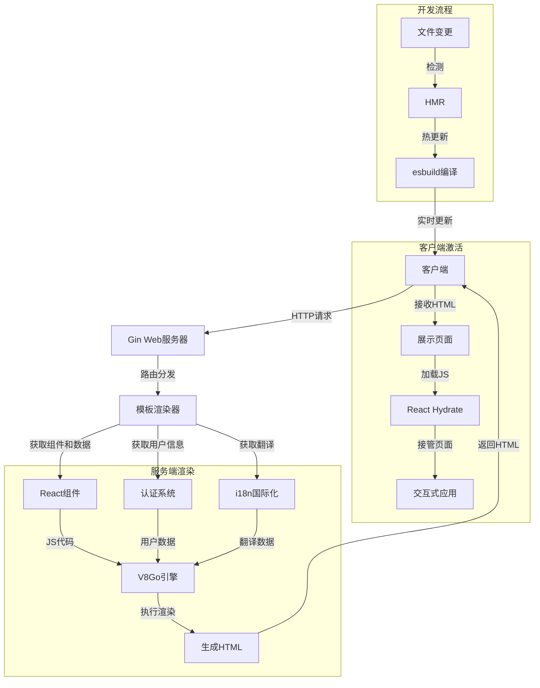

# GoReact

GoReact 是一个结合 Go 后端和 React 前端的服务端渲染(SSR)框架，旨在提供高性能、易维护的全栈开发体验。

## 项目特性

- **服务端渲染(SSR)**: 使用 Go 在服务端渲染 React 组件，提升首屏加载速度和 SEO 友好性
- **热模块替换(HMR)**: 开发环境支持实时预览修改效果，无需手动刷新
- **国际化支持**: 内置 i18n 支持，轻松实现多语言网站
- **安全性**: 默认开启各种安全头部，如 XSS 保护、内容类型保护等
- **现代化 UI**: 使用 Radix UI、TailwindCSS 构建现代化界面
- **认证系统**: 内置 JWT 认证机制，支持 Google OAuth

## 技术栈

### 后端
- Go 1.24+
- Gin Web 框架
- V8Go (JavaScript 运行时)
- esbuild (JS/CSS 编译)

### 前端
- React 19
- Radix UI 组件库
- TailwindCSS
- TypeScript

## 项目架构

```
goreact/
├── auth/         # 认证相关逻辑
├── base/         # 基础功能模块
├── cmd/          # 应用入口
├── conf/         # 配置文件
├── dao/          # 数据访问对象
├── i18n/         # 国际化支持
├── mcp/          # MCP 客户端
├── model/        # 数据模型
├── server/       # 核心服务器代码
│   ├── build.go        # 构建逻辑
│   ├── esbuild.go      # esbuild 集成
│   ├── hmr.go          # 热模块替换
│   ├── react_render.go # React 渲染器
│   ├── server.go       # 服务器配置
│   └── templates/      # HTML 模板
└── ui/           # 前端代码
    ├── blocks/       # UI 块组件
    ├── components/   # 可复用组件
    ├── layout/       # 布局组件
    └── lib/          # 工具库
```

## 调用流程




## 工作原理

1. Go 服务器接收 HTTP 请求
2. 服务器确定要渲染的 React 组件和数据
3. 使用 V8 引擎在服务端执行 React 组件的渲染
4. 生成 HTML 并发送到客户端
5. 客户端接收并展示渲染好的 HTML
6. React 在客户端"激活"(hydrate)页面，接管交互性

## 快速开始

### Demo Site

[](https://whoismaking.money)
[](https://4oimg.art)

### template

```bash
git clone https://github.com/daodao97/go-react-ssr-template
cd go-react-ssr-template
go mod tidy
npm i 
```

## 贡献指南

欢迎提交 Pull Request 或提出 Issue 来改进本项目。

## 许可证

本项目采用 MIT 许可证。
